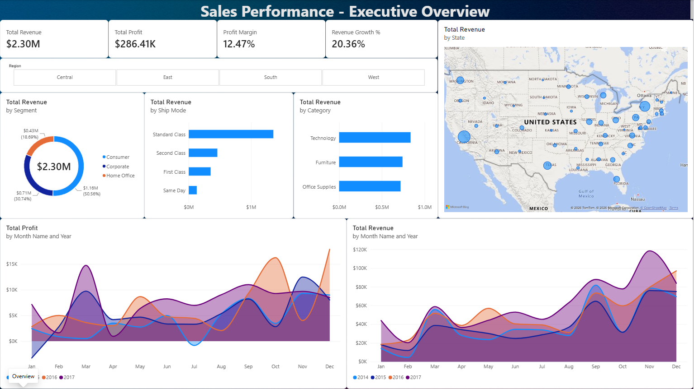
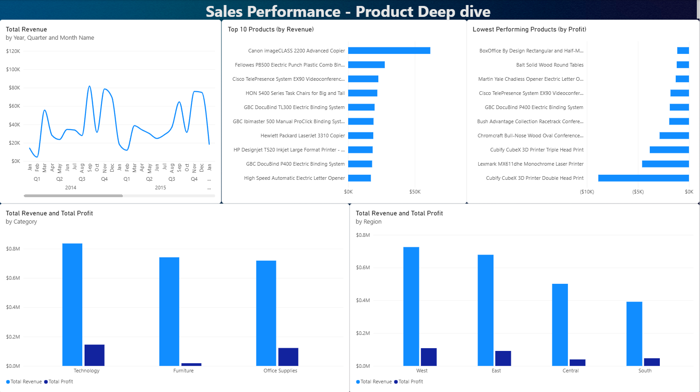

# Sales Performance Dashboard

Week 1 project for the **Syntecxhub Data Analysis Internship**. An interactive Power BI dashboard analyzing sales, profit, and regional performance for a retail superstore.




## Objective

Import, clean, and analyze a raw sales dataset to surface trends, top/bottom performers, and regional and category-level insights, then present them as an interactive dashboard.

## Dataset

- **Source:** [Sample Superstore dataset](https://www.kaggle.com/datasets/vivek468/superstore-dataset-final) (Kaggle)
- **Size:** 9,994 rows × 21 columns
- **Fields:** Order/Ship Date, Ship Mode, Customer, Segment, Region, Category/Sub-Category, Product Name, Sales, Quantity, Discount, Profit
- Raw file included at `data/Sample - Superstore.csv`

## Tools Used

- **Power BI Desktop** - data cleaning (Power Query), data modeling, DAX measures, and visualization
- **DAX** for KPI and time-intelligence calculations

## Data Cleaning

The dataset had no nulls and no fully duplicated rows, but two real issues surfaced during validation rather than a surface-level check:

- **Inconsistent date formats:** `Order Date` and `Ship Date` mixed `DD-MM-YYYY` and `M/D/YYYY` formats within the same column (~4,000 vs ~6,000 rows respectively). Fixed by explicitly parsing both columns with a US locale in Power Query, then validated by confirming no row had an Order Date later than its Ship Date.
- **One genuine duplicate line item:** Order `US-2014-150119`, Product `FUR-CH-10002965` appeared twice with identical quantity, sales, and discount. Removed via an indexed row filter (all other repeated Order ID + Product ID pairs were legitimate split line items with differing quantities, and were kept).

## Data Model

- `Sample - Superstore` - the cleaned fact table
- `DateTable` - a dedicated date dimension (`CALENDAR()`-generated, marked as the official Date table) with Year, Quarter, Month Name, Month Number, and a sort key so months display in chronological rather than alphabetical order
- `_Measures` - a dedicated table holding all DAX measures, kept separate from the data tables for a cleaner model
- One-to-many relationship: `DateTable[Date]` → `Sample - Superstore[Order Date]`

## Key Measures (DAX)

```DAX
Total Revenue = SUM('Sample - Superstore'[Sales])
Total Profit = SUM('Sample - Superstore'[Profit])
Profit Margin = DIVIDE([Total Profit], [Total Revenue])
Total Orders = DISTINCTCOUNT('Sample - Superstore'[Order ID])

Revenue Growth % =
VAR LatestYear = MAX(DateTable[Year])
VAR CurrentRev = CALCULATE([Total Revenue], DateTable[Year] = LatestYear)
VAR PriorRev = CALCULATE([Total Revenue], DateTable[Year] = LatestYear - 1)
RETURN DIVIDE(CurrentRev - PriorRev, PriorRev)
```

## Dashboard

Two pages:

**1. Executive Overview** - landing page. KPI cards (Total Revenue, Total Profit, Profit Margin, Revenue Growth %), sales by Segment, Ship Mode, Category, a state-level map, and monthly Sales/Profit overlaid by year, with a Region slicer.

**2. Product Performance** - monthly/quarterly/yearly sales trend (drillable), Top 10 products by revenue, Lowest 10 products by profit, and Revenue/Profit comparisons by Category and Region.

## Key Insights

- Revenue shows a clear seasonal pattern, with a spike every November–December, and an overall upward trend from 2014 to 2017.
- Total revenue grew **20.36%** in the most recent year over the prior year; growth varies notably by region (e.g., the Central region was roughly flat year-over-year).
- About **19% of all line items (1,871 of 9,994) were sold at a loss**, indicating discounting is eating into profitability on a meaningful share of orders.
- The "lowest performing" products by raw revenue turned out to be low-price, low-volume consumables (paper clips, highlighters) rather than genuine underperformers. Profit was a more meaningful lens for identifying products that are actively losing money.

## Repository Structure

```
Syntecxhub_Sales_Performance_Dashboard/
├── Syntecxhub_Sales_Performance_Dashboard.pbix
├── Syntecxhub_Sales_Performance_Dashboard.pdf
├── data/
│   └── Sample - Superstore.csv
├── docs/
│   ├── overview.png
│   └── product-performance.png
└── README.md
```

## About

Built as part of the [Syntecxhub](https://www.syntecxhub.com) Data Analysis Internship Program - Week 1.
